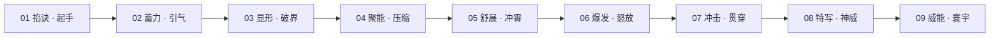

# 9G-onlyno999 · 九宫格修仙大招分镜工坊 (Xianxia 9-Grid Storyboard Studio)

[](https://github.com/onlyoyrao999/D-Z-P-Z-W)
[](https://github.com/onlyoyrao999/D-Z-P-Z-W)
[](https://react.dev/)
[](https://ai.google.dev/)

> **9G-onlyno999** 是专为国风仙侠漫剧、3D玄幻动画短剧及视频博主打造的 **3×3 九宫格法术大招动作分镜生成工作台**。
> 深度整合来自 [GitHub onlyoyrao999/D-Z-P-Z-W](https://github.com/onlyoyrao999/D-Z-P-Z-W) 的动作心法与终极奥义，将复杂的终极法术拆解为 **9 个符合专业影视摄影机调度的连贯镜头**，彻底解决 AI 视频生成中角色跳脱、动作断层与画风混乱的痛点！

---

## 📖 核心心法与三大原则 (Core Philosophy)



### 1. 🛡️ 画风锁死 (Style Locking)
- **核心关键词**：`中国风修仙主题，顶级影视CG动画风格，超写实3D渲染画质，黑色背景，高反差电影级光影`
- **设计目的**：锁定纯黑虚空背景与强体积边缘光（Volumetric Rim Light），强制 AI 锁定角色轮廓与法术粒子折射，彻底规避画风混杂。

### 2. 🔥 特效核心 (Particle & Entity Core)
- **视觉主体**：以半透明灵体神兽/法相（如中国青龙能量形态）为大招核心。
- **粒子要求**：粒子细腻绵密，自带动态消散、流光流转、翡翠灵光与能量氤氲效果，高光锐利通透、暗部深邃干净，兼顾爆发冲击力与微观鳞片/符文质感。

### 3. 🎬 镜头逻辑 (9-Step Chronological Progression)
- 9张图严格按“**起手 ➜ 蓄力 ➜ 显形 ➜ 聚能 ➜ 舒展 ➜ 爆发 ➜ 冲击 ➜ 特写 ➜ 收尾**”排布，全景切片后导入可灵/Runway/即梦生成视频，动作天然连贯绝不跳脱！

---

## ⚡ 3×3 九宫格动作拍摄调度表

| 序号 | 分镜阶段 | 镜头焦距与景别 | 拍摄角度与透视 | 动作导演指令 (Director Script) | 视觉特效与光影重点 |
| :---: | :--- | :--- | :--- | :--- | :--- |
| **01** | **掐诀** (Mudra) | 35mm 特写/微距 | 45度侧视半特写 | 双手指法翻飞，结出玄奥古法印诀 | 指尖符文流光微绽，微观灵气粒子升腾 |
| **02** | **蓄力出招** (Charge) | 24mm 仰拍大透视 | 极低角度大仰角 | 身形微沉引气，衣袍长发狂舞 | 周天灵气漏斗倒灌，脚下阵图旋转 |
| **03** | **术法显现** (Manifest) | 28mm 中景纵深 | 斜侧45度大空间 | 剑指点出，身后虚空撕裂 | 半透明灵体神兽虚影破界初露峥嵘 |
| **04** | **术法凝聚** (Condense) | 18mm 广角大张力 | 正面大广角向心 | 双臂合抱，漫天能量极限压缩 | 能量光轨向心凝实，空间剧烈扭曲 |
| **05** | **术法舒展** (Unfurl) | 14mm 超广角全景 | 大旋转俯仰镜头 | 巨型法相咆哮腾空，盘旋环绕 | 绵延千丈横贯画面，龙须符文锁链飞舞 |
| **06** | **大招爆发** (Release) | 16mm 鱼眼广角 | 近身极度夸张透视 | 倾尽修为双掌悍然轰出 | 核爆级能量冲击波，多重气爆环炸裂 |
| **07** | **出招冲击** (Impact) | 50mm 追焦跟随 | 过肩侧后方高速跟随 | 法相化作破虚光柱极速贯穿 | 超音速流光尾迹与空间碎裂拉丝 |
| **08** | **大招特写** (Close-Up) | 85mm 肖像微距 | 微距低角度仰视 | 核心龙首怒目圆睁，口含龙珠 | 晶莹翡翠鳞片纤毫毕现，三点布光 |
| **09** | **攻击威能** (Apocalypse) | 12mm 远景全景 | 极远高空俯瞰全景 | 命中天地引发通天光柱与毁灭涟漪 | 环形能量波荡平万里，漫天光尘如雨 |

---

## 🌟 核心功能矩阵 (Feature Matrix)

- 🐉 **九大功法流派一键替换**：
  - **碧霄青龙**（木/风/灵 · 九天苍龙）
  - **万剑归宗**（金/剑意 · 庚金破虚）
  - **幽冥紫焰**（魔/幽火 · 九幽魔尊）
  - **冰凤凌霄**（冰/水 · 万古玄冰）
  - **赤霄神雷**（雷/劫 · 九天雷帝）
  - **业火红莲**（火/佛道 · 纯阳真火）
  - **幽冥黑龙**（暗/煞 · 深渊黑曜）
  - **乾坤八卦**（阴阳/混元 · 两仪化生）
  - **虚空破灭**（空间/星辰 · 维度撕裂）

- 🌐 **D-Z-P-Z-W 终极奥义 GitHub 在线载入器**：
  - 一键拉取并解析 [GitHub D-Z-P-Z-W](https://github.com/onlyoyrao999/D-Z-P-Z-W) 终极奥义动作库。
  - 支持自定义输入功法口诀或 Skill Markdown，AI 自动重构为九宫格分镜。

- 🎭 **【图1】角色外观锁定器 (Reference Locking)**：
  - 上传角色参考图，Gemini 视觉大模型智能提取服饰、发冠、玉佩、法宝与气质特征，锁定 9 镜人物高度一致。

- 🎞️ **动态漫剧播放器 (Cinematic Animatic Player)**：
  - 1~9 动作帧循环播放、多档调速（0.5s ~ 2.0s）、影视级震屏特效、动态音效合成（掐诀清鸣/蓄力轰鸣/核爆音效）。

- 📦 **智能切片与一键打包 (Export Suite)**：
  - Canvas 智能无损切片为 9 张独立的 16:9 高清大图，并一键生成带说明文档的 ZIP 压缩包。

- 📝 **多平台 Prompt 母版生成器**：
  - 实时输出 **中文原版母版**、**Midjourney v6.1 (`--ar 16:9 --style raw`)**、**Flux / SDXL**、**Gemini / Imagen 3** 及**负向提示词**。

---

## 🛠️ 技术栈架构 (Tech Stack)

| 层次 | 技术选型 | 说明 |
| :--- | :--- | :--- |
| **前端核心** | React 19 + TypeScript + Vite 8 | 次世代现代化 SPA 架构 |
| **样式与视觉** | Tailwind CSS v4 + Motion | 电影级黑金暗黑修仙 UI |
| **AI 视觉与大模型** | `@google/genai` (Gemini 2.5 Flash / Imagen 3) | 角色图分析、奥义解构与九宫格图像生成 |
| **切片与导出** | HTML5 Canvas + JSZip | 3×3 矩阵切割与多文件 ZIP 导出 |
| **特效组件** | Canvas Confetti + Web Audio API | 粒子礼花与动作合成音效 |
| **全栈服务** | Express + TSX Proxy Server | API 安全代理与静态资源托管 |

---

## 🚀 快速启动 (Quick Start)

### 1. 克隆与安装依赖
```bash
npm install
```

### 2. 配置环境变量
复制 `.env.example` 为 `.env` 并填入 Gemini API Key：
```env
GEMINI_API_KEY="YOUR_GEMINI_API_KEY"
PORT=3000
```

### 3. 本地开发
```bash
npm run dev
```
访问开发服务器：`http://localhost:3000`

### 4. 生产构建与启动
```bash
npm run build
npm run start
```

---

## 🎬 漫剧视频生成工作流 (AI Video Pipeline)

```text
[ 9G-onlyno999 工坊 ]
         │
         ▼
[ 导出 9 张 16:9 动作切片图 (ZIP) ]
         │
         ▼
[ 导入 可灵 AI (Kling) / Runway Gen-3 / 即梦 (Jimeng) / Sora ]
         │
         ├─ 首尾帧模式：第1镜 ➔ 第2镜（起手 ➔ 蓄力）
         ├─ 图生视频模式：第5镜 ➔ 第6镜（舒展 ➔ 爆发）
         └─ 尾帧收尾模式：第7镜 ➔ 第9镜（冲击 ➔ 威能）
         │
         ▼
[ 丝滑连贯的影视级修仙打斗大招视频诞生！]
```

---

## 📄 开源协议与鸣谢 (License & Credits)

- 本项目动作心法灵感源自：[onlyoyrao999/D-Z-P-Z-W](https://github.com/onlyoyrao999/D-Z-P-Z-W)
- 遵循 Apache-2.0 开源协议。
